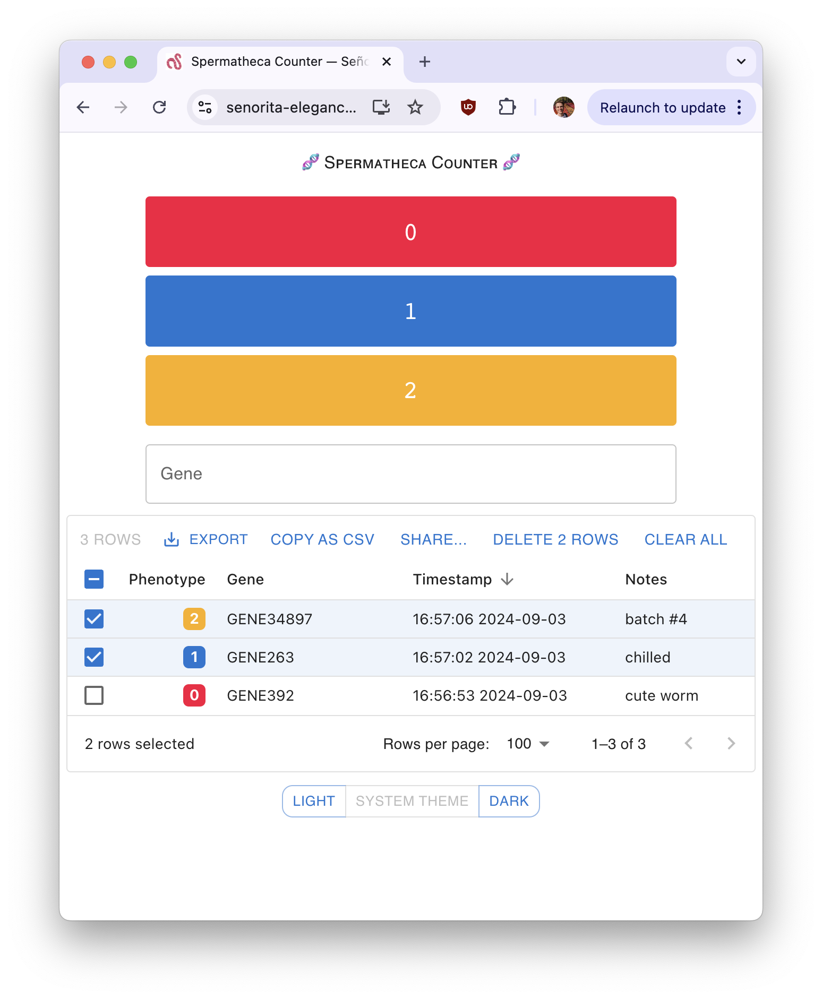

# Señorita Elegance 🔬🪱

A responsive web app that simplifies counting and logging phenotypes for C. elegans worms.

[Try it out!](https://senorita-elegance.vercel.app/)

Features:

- ✨ Simple, intuitive interface.
- 📱 Works great on both mobile and desktop.
- ⏱️ Automatically timestamps all logged data.
- 💾 Persists data across browser sessions.
- 📊 Exports logged data to CSV.
- 📝 Supports adding row-level comments to data.
- 🕶️ Support for dark mode to ease eye strain when operating in a dark lab.

## The Name

"Señorita Elegance" is a silly pun on "C. elegans," the species of worm it was developed to help research. It also lends a certain air of sophistication to the project. 🌟

## Getting Started

In the project directory, you can run:

### `npm start`

Runs the app in the development mode.\
Open [http://localhost:3000](http://localhost:3000) to view it in your browser.

The page will reload when you make changes.\
You may also see any lint errors in the console.

### `npm test`

Launches the test runner in the interactive watch mode.\
See the section about [running tests](https://facebook.github.io/create-react-app/docs/running-tests) for more information.

### `npm run build`

Builds the app for production to the `build` folder.\
It correctly bundles React in production mode and optimizes the build for the best performance.

The build is minified and the filenames include the hashes.\
Your app is ready to be deployed!
